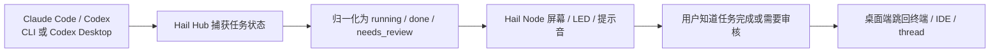
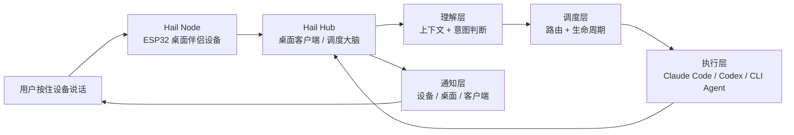
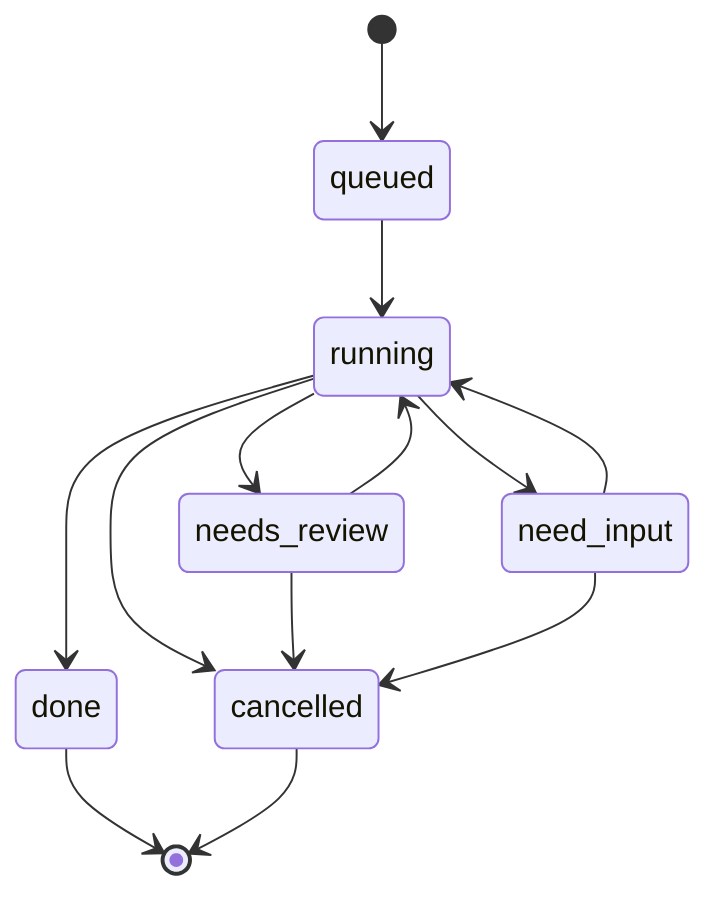
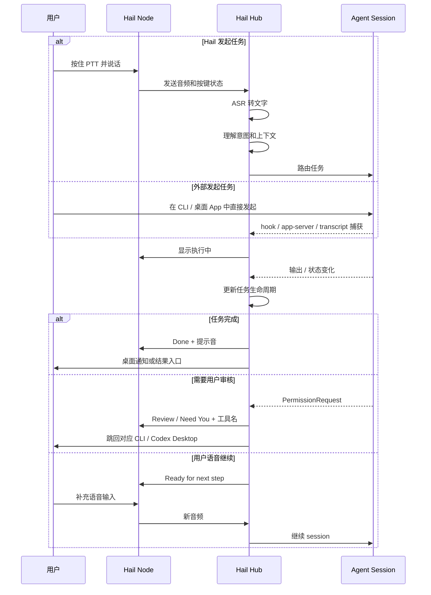

# Hail 产品定义

Hail 是一个 Code Agent 完成提醒与语音调度系统：一个 ESP32 桌面伴侣设备负责状态提示、语音收发和轻量确认，一个桌面客户端负责捕获 Claude Code / Codex 等 Agent 的任务状态、理解意图、调度 Agent、管理任务生命周期。MVP 中，Code Agent 完成任务或需要用户审核时，Hail Node 会用屏幕、LED 和提示音提醒用户；用户也可以按住设备说话，让 Hail 接着调度下一步。

一句话版本：

> Hail 是你的桌面 Code Agent 完成铃和语音调度器。Agent 跑完会叫你；你说下一步，它找到对的 Agent 继续干活。

## 1. 产品判断

这个产品形态的核心不是“语音输入”，而是“把 Code Agent 的任务状态带出屏幕，并用一个明确的物理入口继续调度”。

关键判断：

- ESP32 设备不应该被定义成“语音棒”，而应该是一个桌面伴侣设备。它常驻在显示器旁边，永远在手边。
- 桌面客户端不只是中转站，而是系统大脑。它要知道有哪些 Agent、哪些 session 正在跑、谁需要用户审核、哪些任务需要提醒用户。
- ASR 只是输入管线的一环，真正有价值的是理解层、调度层和任务生命周期管理。
- 设备不应该只有“输入”能力，还应该能承担提醒确认、状态仪表盘和轻量任务控制。
- 审核请求是 Agent 工作流里的高频阻塞点，Hail MVP 应该把“需要你审核”设计成一等提醒，而不是普通通知。
- 捕获已有 Agent 会话和完成事件是核心能力。Hail 不应该只管理“由 Hail 发起”的任务，也要能观察用户直接在 Claude Code / Codex 命令行版或桌面版里启动的任务，并在完成或需要用户审核时提醒。
- MVP 先验证两件事：设备是否能稳定提醒 Code Agent 完成任务；任务完成后，用户是否愿意用语音继续指挥下一步。验证成立后，再扩展多 Agent、意图理解、语音播报和用户偏好学习。

## 2. 参考项目启发

这几个项目验证了“Agent 状态外设”这个方向是成立的，但 Hail 的定位应该更贴近物理工作流：它不是只观察 Agent，也不是只显示用量，而是把 Code Agent 的完成和审核需求变成桌面上的可感知提醒，并允许用户用声音继续接管下一步。

| 参考项目 | 已验证的方向 | 对 Hail 的启发 |
| --- | --- | --- |
| Clawd on Desk | 桌面宠物可以实时映射 Agent 状态，支持多 Agent、多 session、权限气泡、HUD、终端聚焦和完成提醒 | Hail Hub 需要抽象统一的 Agent event -> task state -> device state 映射；权限确认、session dashboard 和状态优先级要进入产品定义 |
| Clawdmeter | ESP32 桌面屏可以作为 Claude Code 用量仪表盘；BLE HID 按钮可以直接触发 Claude Code 语音模式和模式切换；固件用 HAL 支持多硬件 | Hail Node 不能只做麦克风，还应该有快捷控制、用量/上下文视图、可移植硬件抽象和离线保留最近状态 |
| Claude Desktop Buddy | Claude 桌面端可以通过 BLE 连接 maker 设备，设备可以显示 permission prompt、recent messages，并从设备端 approve / deny | Hail 的协议应该兼容“heartbeat snapshot + permission decision + recent entries”的思路，把设备端确认作为核心交互 |
| Open Island | macOS 顶部控制面板可以通过 hooks、transcript/session discovery、Codex Desktop app-server、terminal jump-back 来捕获 coding agent 状态 | Hail Hub 必须有“旁路捕获”能力：即使用户没有通过 Hail 发起任务，也能发现 Claude Code / Codex CLI / Codex Desktop 的运行、完成和审核需求 |

Hail 和这些项目的差异：

- Clawd on Desk 偏“桌面可视化伴侣”，核心是看见 Agent 在做什么；Hail 要在此基础上增加语音发起、意图理解和调度。
- Clawdmeter 偏“用量仪表盘 + 快捷键控制”，核心是监测 Claude Code 使用率；Hail 可以吸收仪表盘和 HID 快捷控制，但主线仍是任务调度。
- Claude Desktop Buddy 偏“官方 BLE maker bridge 示例”，核心是把 Claude 桌面状态开放给硬件；Hail 可以参考其协议语义，但不能把产品局限为 Claude 的外设。
- Open Island 偏“桌面顶部 Agent 控制面板”，核心是捕获本机 agent 会话、显示状态、处理权限和跳回现场；Hail 要把这个能力延伸到物理设备和语音控制。

产品原则因此调整为：

1. **先状态，后智能**：设备和桌面端必须先可靠同步 Agent 状态，再谈意图理解。
2. **审核提醒是一等交互**：MVP 先提醒用户回到原现场审核；approve / deny / always allow / later 等设备端操作放到后续版本。
3. **设备是控制台，不是显示器**：屏幕显示状态，但按钮、语音和提示音共同构成任务控制面板。
4. **协议优先于具体硬件**：Hail Node 可以有多个硬件版本，协议和状态语义要稳定。
5. **每个 Agent 能力不同**：adapter 要显式标注能力边界，例如是否支持权限拦截、终端聚焦、session end、subagent 事件。
6. **完成提醒是第一价值**：第一版不一定要完整控制 Agent，但必须能可靠发现“谁在跑、谁跑完、谁需要你”，并通过设备提醒用户。

## 3. 核心产品循环

Hail 有两个互相连接的产品循环。

第一条是 **捕获 -> 提醒 -> 回到现场**：



第二条是 **提醒 -> 语音接管 -> 继续调度**：


第一版要优先把第一条循环跑通。只要 Claude Code / Codex 任务完成后，设备能稳定提醒，Hail 就已经有明确价值；语音调度是这个价值的自然延伸。

## 4. 产品全景



系统由两部分组成：

- **Hail Node**：ESP32 设备，负责按键、收音、屏幕、提示音、LED 和本地状态反馈。
- **Hail Hub**：桌面客户端，负责 ASR、上下文理解、Agent 路由、任务生命周期、通知和会话管理。

## 5. Hail Node：ESP32 桌面伴侣设备

Hail Node 是用户和 Agent 系统之间的物理入口。它的价值不只是采集声音，而是创造一个明确、低摩擦、有仪式感的“现在我要对 Agent 发号施令”的动作。

| 组件 | 作用 | 为什么需要 |
| --- | --- | --- |
| 麦克风 | 收音 | 比电脑内置麦克风离嘴更近，降噪和稳定性更好 |
| PTT 按钮 | 按住说话 | 明确表达“现在是在对 Agent 说话”，减少误触发，也形成仪式感 |
| 屏幕 | 状态显示 | 显示空闲、正在听、执行中、已完成、需要用户审核等状态 |
| 蜂鸣器 / 小喇叭 | 提示音 | 用短声音反馈完成、需要用户审核等事件 |
| LED | 呼吸灯 / 状态灯 | 用颜色快速传达状态，绿=空闲，蓝=处理中，黄=需要你，红=出错 |
| 二级按钮 / 触摸 | 快捷动作 | 可用于取消、切换目标 Agent、确认提醒、翻页查看状态 |
| BLE HID | 兼容控制 | 在部分场景下直接发送 Space、Shift+Tab 等快捷键，作为低耦合 fallback |

屏幕可以承担更丰富的信息反馈，例如：

- 当前运行中的任务名。
- 当前负责的 Agent 名称。
- 任务运行状态。
- 最近一条输出或等待审核的工具名。
- 当前 session / 今日用量 / 剩余上下文等仪表盘信息。
- 等待用户审核时的简短提示。
- 长任务倒计时或运行时长。

推荐基础状态：

| 状态 | 屏幕 | LED | 声音 |
| --- | --- | --- | --- |
| 空闲 | Ready | 绿色呼吸 | 无 |
| 正在听 | Listening | 蓝色常亮 | 开始提示音 |
| 处理中 | Running / Agent 名 | 蓝色呼吸 | 无 |
| 审核提醒 | Review / 工具名 | 黄色快闪 | 双短提示音 |
| 需要用户 | Need You | 黄色闪烁 | 双短提示音 |
| 已完成 | Done | 绿色闪烁后回空闲 | 完成提示音 |
| 出错 | Failed | 红色闪烁 | 低频错误提示音，MVP 可先只在屏幕显示 |

Hail Node 第一版建议保留三种屏幕视图：

| 视图 | 内容 | 触发方式 |
| --- | --- | --- |
| 任务视图 | 当前 Agent、任务名、状态、等待原因 | 默认视图 |
| 仪表盘视图 | 今日用量、session 数、运行中 / 需要审核数 | 触摸或二级按钮切换 |
| 审核视图 | 工具名、风险提示、回到现场提示 | 有审核请求时自动置顶 |

设备端动作建议：

- 主按钮按住：语音输入。
- 主按钮短按：确认当前完成提醒 / 唤醒屏幕。
- 二级按钮短按：取消或返回。
- 二级按钮长按：切换目标 Agent 或进入设备菜单。
- 审核提醒态下：主按钮确认已看到提醒，二级按钮静音本次提醒。

## 6. Hail Hub：桌面调度大脑

Hail Hub 是产品真正的核心。它不只是把语音转成文字再粘贴到某个窗口，而是一个智能调度中心。

它要回答四个问题：

1. 用户刚才说的话是什么意思？
2. 这句话应该交给哪个 Agent 或哪个 session？
3. 这个任务现在处在什么生命周期阶段？
4. 什么时候、用什么方式打扰用户？
5. 当前是否有审核请求、风险操作或阻塞状态需要用户回到现场？
6. 哪些 Claude Code / Codex 任务是用户从别处启动的，但也应该被 Hail 捕获和提醒？

### 6.1 Agent 捕获层

Agent 捕获层负责发现和跟踪本机正在运行的 coding agent。它和“调度层”不同：调度层管理 Hail 发起的任务，捕获层则观察所有相关任务，包括用户直接在终端、IDE 或桌面 App 里启动的任务。

第一优先级应该覆盖四类目标：

| 目标 | 捕获方式 | 关键事件 |
| --- | --- | --- |
| Claude Code CLI | hooks、JSONL transcript、进程 / 终端识别、status line bridge | MVP 关注 done、needs_review |
| Codex CLI | hooks、`~/.codex/sessions/` JSONL fallback、进程 / 终端识别 | MVP 关注 done、needs_review |
| Codex Desktop | app-server / JSON-RPC、deep link、桌面进程识别 | MVP 关注 done、needs_review |
| Claude Desktop / Claude app | 官方可用的桌面集成、Hardware Buddy bridge、窗口 / 通知 fallback | 后续关注 recent messages、done、attention |

捕获层产出的不是原始日志，而是统一的 `AgentEvent`：

```json
{
  "event": "done",
  "agent": "codex-desktop",
  "surface": "desktop",
  "session_id": "thread_123",
  "task_id": "turn_456",
  "title": "Fix login test",
  "jump_target": "codex://threads/thread_123",
  "summary": "Edited 2 files, tests passed",
  "status": "done",
  "at": "2026-06-10T10:42:00Z"
}
```

捕获层必须遵守 fail-open 原则：如果 Hail Hub 没有运行，Claude Code / Codex 的原生工作流不能被破坏；如果 Hail 捕获失败，Agent 仍应继续运行，最多是少一次提醒。

### 6.2 Session 管理

桌面客户端需要实时感知本机 Agent session 的状态：

- 哪些 session 存在。
- 哪个 session 正在运行任务。
- 哪个 session 空闲。
- 哪个 session 正在等待用户审核。
- 哪个 session 刚完成任务。
- 哪个 session 卡住或需要用户回到现场。

第一阶段可以只支持 Claude Code 的单 session。后续扩展到多 session、多 Agent 时，Session 管理会成为调度层的基础。

Session 管理需要额外维护两类信息：

- **可见状态**：设备和桌面 UI 应该显示给用户看的状态，例如 running、done、needs_review。
- **能力状态**：adapter 自己知道但用户不一定关心的能力边界，例如是否支持权限拦截、是否支持 terminal focus、是否支持 session end 事件、是否只能轮询日志。
- **来源状态**：任务是 Hail 发起、用户从终端发起、用户从桌面 App 发起，还是恢复自历史 transcript。

这能避免一个常见问题：不同 Agent 的 hooks 能力不一致，如果产品把所有 Agent 都假设成 Claude Code，会在多 Agent 阶段产生大量“看起来支持、实际不可靠”的体验断裂。

### 6.3 理解层：不是 ASR，而是“懂你”

ASR 只负责把声音转成文字，理解层负责判断用户真实想做什么。

理解层需要结合：

- **用户是谁**：偏好、常用 Agent、常用命令风格、是否喜欢同步等待。
- **用户在哪**：当前前台应用、当前项目、当前 Agent 状态。
- **之前发生了什么**：上一轮任务、最近完成的 session、等待审核的任务。
- **这句话本身**：指令、补充说明、确认、取消、继续、追问。

例子：

- 用户说“继续”，Hail 要判断是继续 Claude Code 中没做完的文件，还是继续 Codex 里跑了一半的测试。
- 用户说“让它改一下刚才那个报错”，Hail 要知道“它”是谁，“刚才那个报错”来自哪个 session。
- 用户说“跑完告诉我”，Hail 要把当前任务标记成异步执行，并设置完成提醒。

MVP 阶段可以先不做完整理解层，采用手动路由或固定 session 路由。但产品定义上应该保留理解层的位置。

### 6.4 调度层：路由 + 生命周期

调度层负责把用户意图变成可执行任务，并管理任务从发起到结束的完整过程。

一个任务可能会持续几秒，也可能跑 10 分钟；中间可能完成、需要用户审核、卡住或等待补充输入。因此 Hail 需要维护任务状态机。

推荐任务状态：



调度层的核心决策：

- 这个任务交给哪个 Agent？
- 交给已有 session，还是启动新 session？
- 任务应该同步等待，还是异步后台跑？
- 完成后是否需要提醒？
- 等待用户输入时，应该通过设备、桌面通知还是客户端弹窗提醒？
- 如果是审核请求，如何提示用户回到对应 CLI / Codex Desktop？
- 如果 adapter 只能观察状态，是否需要把审核留在 Agent 原生终端里？
- 如果任务不是 Hail 发起的，是否只提醒，还是允许后续语音接管？

### 6.5 执行层：Agent Adapter

Hail 不需要重新造 Agent，而是给不同 Agent 做适配器。

每个 Agent 一个 adapter：

- Claude Code adapter。
- Codex adapter。
- 通用 CLI adapter。
- 未来可扩展到其他桌面 Agent 或自动化工具。

Adapter 的职责：

- 发现已有 session。
- 创建或连接 session。
- 发送用户任务。
- 读取输出流。
- 识别状态：运行中、完成、需要用户审核。
- 识别审核请求：工具名、风险提示、request id、跳回现场入口。
- 生成 jump target：终端、tmux pane、IDE workspace、Codex Desktop thread deep link。
- 提供任务摘要和结果链接。
- 支持取消、继续、补充输入等控制动作。

每个 adapter 应声明能力矩阵：

| 能力 | 含义 | 产品影响 |
| --- | --- | --- |
| `state_events` | 能否实时收到运行、完成、审核请求等事件 | 决定设备状态是否实时 |
| `review_detection` | 能否识别需要用户审核的请求 | 决定是否显示 Need Review 提醒 |
| `session_identity` | 能否区分多个 session | 决定是否支持多 session dashboard |
| `terminal_focus` | 能否跳转到对应终端 / 窗口 | 决定桌面端“打开现场”是否可靠 |
| `desktop_deeplink` | 能否跳转到桌面 App 中的具体 thread / conversation | 决定 Codex Desktop / Claude Desktop 是否能精确打开 |
| `session_discovery` | 能否从 transcript、进程或桌面服务发现已有会话 | 决定 Hail 是否能捕获非 Hail 发起的任务 |
| `subagent_events` | 能否识别子 Agent / 并行任务 | 决定是否显示多 Agent 忙碌态 |
| `usage_metrics` | 能否读取 token、上下文、用量等指标 | 决定是否显示仪表盘 |

### 6.6 通知层：完成和审核提醒

通知层第一版只解决一个问题：Code Agent 跑完了，或者需要用户审核时，设备要提醒用户。

MVP 只提醒两类事件：

| 事件 | 设备反馈 | 桌面反馈 | 用户动作 |
| --- | --- | --- |
| 任务完成 | 完成提示音，绿灯闪烁，屏幕显示 Done + Agent / 任务名 | 可选桌面通知 | 确认提醒，或回到现场查看结果 |
| 需要用户审核 | 审核提示音，黄灯闪烁，屏幕显示 Review / Need You + Agent / 工具名 | 可选桌面通知和跳回入口 | 回到对应 CLI / Codex Desktop 处理审核 |

用户可以在 Hail Hub 中选择提醒范围。第一版不替用户判断“什么值得提醒”，只负责按用户选择可靠提醒。

提醒范围可以包括：

- 只提醒 Claude Code CLI。
- 只提醒 Codex CLI。
- 只提醒 Codex Desktop。
- 提醒全部已支持 Agent。
- 按项目 / workspace 开关提醒。
- 静音设备声音，只保留屏幕和 LED。

设备端 approve / deny、风险命令分级、自动静默策略都放到后续版本。MVP 中，Hail Node 只提示“需要你审核”，不在设备上直接审核。

## 7. 核心交互循环



## 8. 使用场景

### 场景 1：编码时的“语音续命”

用户正在写代码，Claude Code 跑完一个任务。用户不想切窗口、找输入框、重新描述上下文，只需要按住 Hail Node 说：

> 继续，把刚才那个错误也一起修了。

Hail Hub 根据当前 session 状态知道“继续”指的是刚才完成或正在审核后的 Claude Code session，然后把补充指令发进去。

体验价值：

- 减少上下文切换。
- 不需要手动定位 Agent 窗口。
- “继续”“确认”“换个方案”这类短指令更自然。

### 场景 2：离开电脑

用户去接水或短暂离开，Agent 在后台跑任务。任务完成或需要用户审核时，Hail Node 通过声音和 LED 提醒。

体验价值：

- 用户不用一直盯着终端或客户端。
- 长任务可以异步跑。
- 物理设备成为“桌面任务状态灯”。

### 场景 3：多 Agent 并行

用户同时让 Claude Code 改代码，让 Codex 跑安全扫描。Hail Hub 维护多个 Agent 的状态，并根据用户语音选择目标：

> 问一下 Codex 扫描怎么样了。

或：

> 让 Claude 那边继续按第二个方案改。

体验价值：

- 多 Agent 不再是多个孤立窗口。
- 用户通过自然语言和状态上下文管理并行任务。
- Hail 成为跨 Agent 的调度层。

### 场景 4：审核提醒

Claude Code 准备执行一个需要批准的 Bash 或文件写入操作。用户没有盯着终端，但 Hail Node 黄灯快闪，屏幕显示：

```text
Review
Bash: yarn test
```

用户按一下设备确认自己看到了提醒，然后回到对应 CLI / Codex Desktop 处理审核。MVP 不在设备端直接批准或拒绝。

体验价值：

- 权限请求不再卡在终端里。
- 用户知道应该回到哪个 Agent / session 处理。
- 不在小屏幕上做高风险批准，避免设备端误批。

### 场景 5：桌面 Agent 仪表盘

用户没有发任务，只是看一眼设备屏幕，就知道：

- 当前有几个 session。
- 几个在 running，几个需要审核。
- 今天 Claude Code 用量大概到哪里。
- 哪个 Agent 正在占用注意力。

体验价值：

- 设备成为桌面 Agent 的环境状态灯。
- 用户离开键盘时也能理解系统是否还在工作。
- 对长任务和多 Agent 工作流更有掌控感。

### 场景 6：捕获外部发起的任务完成

用户直接在终端里让 Claude Code 修改代码，或者在 Codex Desktop 里开了一个 thread 跑重构任务。这个任务不是 Hail 发起的，但 Hail Hub 通过 hooks、session discovery 或 app-server 捕获到了它。

当任务完成时，Hail Node 发出完成提示音，屏幕显示：

```text
Codex Done
Fix login test
```

用户可以按一下设备确认提醒，或者在 Hail Hub 中点击“打开现场”，跳回对应终端、tmux pane、IDE workspace 或 Codex Desktop thread。

体验价值：

- Hail 变成所有 Agent 任务的完成提醒器，而不是只服务自己发起的任务。
- 用户可以放心离开电脑，不必记住哪个终端、哪个桌面窗口里有任务在跑。
- CLI 和桌面版 Agent 的体验被统一到同一个物理状态灯和通知层。

## 9. MVP 边界

第一版应该砍到最小可验证单元，优先验证“Code Agent 完成任务后，通过一个物理设备提醒用户”这件事是否可靠、有用、比盯着终端更轻松。语音输入保留在 MVP 内，但它服务于完成提醒之后的“继续调度”。

| MVP 包含 | MVP 不包含 |
| --- | --- |
| 1 个 ESP32 设备 + 桌面客户端 | 手机端 |
| 对接 1 个固定 CLI session 做语音输入 | 多 Agent 自动路由 |
| 捕获 Claude Code CLI 完成事件 | 任意 Agent 全量捕获 |
| 捕获 Codex CLI 完成事件 | 复杂 terminal jump-back 矩阵 |
| 捕获 Codex Desktop 完成事件 | Codex Desktop 复杂控制 |
| PTT 按钮 -> ASR -> 发给 session | 完整意图理解层 |
| 任务完成 -> 设备提示音 | 语音播报摘要 |
| 需要用户审核 -> 设备提示音 | 设备端直接审核操作 |
| 屏幕显示基本状态 | 复杂任务管理 |
| 会话历史透传 | 用户偏好学习 |
| 用户可选择提醒范围 | 跨 Agent 自动权限策略 |

MVP 目标：

- 用户可以按住设备说一句任务。
- 桌面端把语音识别成文本。
- 桌面端把文本发给一个固定 CLI session。
- Claude Code CLI、Codex CLI、Codex Desktop 状态变化能回传到桌面端。
- Claude Code CLI、Codex CLI、Codex Desktop 的任务完成时，设备能显示状态并播放提示音。
- Claude Code CLI、Codex CLI、Codex Desktop 需要用户审核时，设备能提示用户回到对应现场处理。
- 用户可以选择提醒范围，例如只提醒某个 Agent、某个项目，或关闭声音只保留屏幕和 LED。
- 即使任务不是 Hail 发起的，只要来自已支持的 CLI / Codex Desktop 会话，Hail 也能捕获完成并提醒。

MVP 不追求：

- 精准意图理解。
- 多 Agent 自动路由。
- 语音总结结果。
- 复杂的任务队列和优先级。
- 完整偏好系统。
- 设备端直接审核操作。
- 自动批准危险命令。
- 复杂主题 / 宠物动画系统。

## 10. MVP 验证问题

核心问题：

> 当 Claude Code / Codex 完成任务或需要用户审核时，通过一个物理设备提醒用户，是否能显著减少盯终端和切窗口？

第二问题：

> 当设备提醒之后，用户按住设备说“继续 / 修一下 / 跑测试 / 打开结果”，是否比回到键盘重新找上下文更顺？

需要观察的指标：

- 用户是否愿意主动拿起或按下设备。
- 短指令是否比键盘输入更自然。
- 用户是否减少了切窗口次数。
- 任务完成提示是否降低了等待焦虑。
- 设备状态灯和屏幕是否足够让用户理解 Agent 当前状态。
- ASR 错误是否会明显破坏体验。
- 外部发起的 Claude Code / Codex 任务完成后，Hail 是否能稳定捕获并提醒。
- CLI 和桌面版 Agent 的完成提醒是否都能被用户理解成同一套状态语义。
- 需要用户审核时，设备提醒是否足够明确，让用户知道该回到哪里处理。
- 用户是否能自然配置自己的提醒范围，而不是被所有任务打扰。

建议验证路径：

1. 先验证 Claude Code CLI 外部任务捕获和完成提示。
2. 再验证 Codex CLI 外部任务捕获和完成提示。
3. 再验证 Codex Desktop 外部任务捕获和完成提示。
4. 再验证固定 session 的 PTT 输入链路，让提醒之后可以语音继续。
5. 再验证需要用户审核时的设备提醒。
6. 再验证用户可选择提醒范围。
7. 最后再做更多生命周期指令、多 Agent 和理解层。

## 11. 路线图

### Phase 0：现有能力承接

- ESP32 设备采集音频。
- BLE 传输音频和按键状态。
- 桌面端 ASR。
- 基础状态回传到设备。

### Phase 1：MVP 第一版

- 支持 PTT 语音输入。
- 支持把识别文本发给一个固定 CLI session。
- 支持 Claude Code CLI 任务完成和需要用户审核提醒。
- 支持 Codex CLI 任务完成和需要用户审核提醒。
- 支持 Codex Desktop 任务完成和需要用户审核提醒。
- 支持设备屏幕和提示音反馈。
- 支持用户选择提醒范围。
- 统一映射到 `done` / `needs_review` 两类提醒语义。

### Phase 2：提醒体验打磨

- 完善 Codex Desktop thread deep link 或等价 jump target。
- 完善 CLI jump-back：终端窗口、项目路径、tmux pane 的逐步支持。
- 支持桌面通知和任务历史。
- 支持更细的提醒范围配置：按 Agent、项目、workspace、声音开关。

### Phase 3：轻量任务生命周期

- 引入任务 ID 和任务状态。
- 支持继续、取消、确认、补充输入。
- 支持“跑完提醒我”。
- 支持审核请求队列、超时、桌面 fallback 和高风险命令提示策略。

### Phase 4：多 Agent Adapter

- 增加通用 CLI adapter。
- 增加 Cursor、Gemini CLI、OpenCode 等后续 adapter。
- 支持多个 session。
- 支持手动选择或简单规则路由。
- 为每个 adapter 建立能力矩阵和已知限制。
- 增加 Session dashboard / HUD。

### Phase 5：理解层和偏好

- 根据上下文判断“继续”“它”“刚才那个”等指代。
- 学习用户偏好和项目偏好。
- 自动决定同步 / 异步、静默 / 打扰。
- 支持语音播报摘要或结果摘要。
- 学习审核提醒偏好，但默认不自动批准高风险动作。

### Phase 6：硬件平台化

- 抽象 display、input、audio、power、imu、led、buzzer 等 HAL。
- 支持不同屏幕尺寸和不同 ESP32 开发板。
- 支持设备主题 / 状态动画包。
- 支持设备端文件或资源包推送。
- 支持安全配对、忘记设备、重新配对。

## 12. 协议和安全原则

Hail 的协议应该把“状态快照”和“命令事件”分开：

- **状态快照**：Hub 定期下发当前总览，例如 total sessions、running、needs_review、当前消息、最近事件、当前 prompt。
- **一次性事件**：任务完成、审核请求、新消息、错误、设备动作等。
- **设备命令**：ack_notice、cancel、continue、switch target、status ack、unpair。
- **捕获事件**：由 hooks、transcript、app-server 或进程监控发现的外部 Agent 事件。
- **资源推送**：后续用于主题、图标、字体、提示音或设备端动画包。

推荐从一开始保留这些字段：

```json
{
  "total": 2,
  "running": 1,
  "needs_review": 1,
  "agent": "claude-code",
  "surface": "cli",
  "session_id": "local-abc",
  "task_id": "task-123",
  "msg": "review: Bash",
  "source": "hook",
  "jump_target": "terminal://tty/ttys003",
  "entries": ["yarn test", "editing src/App.vue"],
  "usage": { "tokens_today": 31200, "context_pct": 45 },
  "prompt": {
    "id": "req_abc123",
    "tool": "Bash",
    "hint": "yarn test"
  }
}
```

安全原则：

- 审核请求必须带 request id，设备端只展示必要摘要，不直接批准或拒绝。
- 高风险命令不能只靠小屏幕摘要盲批，MVP 必须要求用户回到 CLI / Codex Desktop 确认。
- BLE 链路应支持加密配对；如果传 transcript、tool hint 或命令摘要，不能默认明文。
- 设备要支持 forget / unpair，避免换电脑或转让设备后残留绑定。
- Hub 离线时，Agent 审核流必须 fallback 到原生终端或桌面端，不应因为 Hail 不在线而直接拒绝任务。
- hooks 必须 fail-open：Hail 不在线时不能阻塞 Claude Code / Codex 原生执行。
- 设备端只展示必要摘要，不长期保存敏感 transcript。

## 13. 当前产品命名关系

当前仓库仍保留 VoiceStick / AgentStick 的历史命名。Hail 可以作为新的产品名，建议关系如下：

- **VoiceStick**：原始基础能力，偏语音采集和输入。
- **AgentStick**：过渡阶段命名，强调 ESP32 设备作为 Agent 入口。
- **Hail**：完整产品名，强调“呼叫 / 调度 / 唤起 Agent”的系统能力。

建议后续统一叙事：

> Hail 是产品名；Hail Node 是 ESP32 设备；Hail Hub 是桌面客户端。

## 14. 决策记录

已确定：

- MVP 第一版只验证两件事：语音输入，以及任务完成 / 需要用户审核时的设备提醒。
- MVP 支持 CLI 和 Codex Desktop。CLI 先覆盖 Claude Code CLI、Codex CLI；桌面版先覆盖 Codex Desktop。
- MVP 只提醒两类事件：`done` 和 `needs_review`。
- 用户可以选择提醒范围。Hail 不替用户判断哪些任务重要，只按用户选择提醒。
- MVP 中，设备只提醒需要用户审核，不在设备端直接审核。
- 设备声音默认可以提醒，但用户必须能关闭声音，只保留屏幕和 LED。

仍需决策：

- Claude Code / Codex CLI 的捕获方式具体采用 hooks、JSONL transcript、进程识别中的哪些组合。
- Codex Desktop 捕获采用 app-server / JSON-RPC、deep link，还是先做桌面通知 / 进程 fallback。
- CLI jump-back 第一版要支持到什么粒度：终端窗口、tmux pane、还是只显示项目路径。
- MVP 是否只支持 macOS，还是同步保留 Windows 路线。
- 设备屏幕第一版显示英文固定状态，还是需要中文字体和中文摘要。
- “继续 / 确认 / 取消”这些生命周期指令，第一版用固定关键词，还是通过 LLM 判断。
- 多 Agent 出现后，用户如何显式指定目标 Agent：说 Agent 名、按设备二级按钮、还是在桌面端选择默认目标。
- 是否要兼容 Claude Desktop Buddy 的 Nordic UART JSON 协议，还是保留现有 VoiceStick BLE service 并新增 Hail 协议层。
- 是否要把用量 / context 仪表盘放进 MVP，还是留到 Phase 2。
